# DelRev

<div align="center">

**가정용 도우미 로봇으로 위장해 잠입하는 3D 잠입 액션 게임**

[](https://unity.com)
[](https://docs.microsoft.com/en-us/dotnet/csharp/)
[]()
[]()

### [게임플레이 영상](https://youtu.be/M8obEdlshRk) &nbsp;·&nbsp; [스토리 영상](https://youtu.be/TNu-wWInctg)

</div>


## 목차

|순번|항목|
|:---:|:---|
| 1 | [프로젝트 개요](#1) |
| 2 | [개발 팀](#2) |
| 3 | [주요 기능](#3) |
| 4 | [사운드 디자인](#4) |
| 5 | [트러블슈팅](#5) |
| 6 | [코드 구조](#6) |
| 7 | [설치 및 실행](#7) |
| 8 | [수상 내역](#8) |

---

<a id="1"></a>
## 1. 프로젝트 개요

**플레이어는 가정용 도우미 로봇으로 위장한 스파이 로봇이다.**

두 헤지펀드 A사와 B사가 대립한다. A사는 경쟁사의 내부 정보를 얻기 위해, 가정용 로봇의 외형과 기능을 그대로 유지한 채 정보 수집과 침투가 가능하도록 프로그래밍된 도우미 로봇을 만든다. 그 로봇이 플레이어다.

**DelRev**는 이 로봇이 가정주택 · 유치원 · 연구소 · 공장에 잠입해 임무를 수행하고, 스테이지마다 다른 방해자에게서 도망치며 생존하는 3D 잠입 액션 게임이다.

플레이어는 체력과 스태미나뿐 아니라 **위험게이지**를 관리해야 한다. 들키지 않는 것과 할당량을 채우는 것을 동시에 해내야 하고, 둘은 서로 반대 방향으로 당긴다.

- **개발 기간:** 2025.04 – 2026.01 (첫 커밋 ~ 마지막 개발 커밋)
- **개발 엔진:** Unity 2022.3.47f1
- **개발 언어:** C#
- **플랫폼:** PC (Windows / macOS)

<details>
  <summary>상세 통계</summary>

  | | |
  |---|---|
  | 팀 작성 스크립트 | `Assets/1.Script` 기준 **94개 파일 · 9,862줄** |
  | 저장소 커밋 | **234커밋** (전 브랜치 기준) |
  | 게임 씬 | `Assets/0.Scenes` 기준 9개 |
  | FSM 방해자 | **11종** (`enum State`를 가진 몬스터 기준) |
  | 방해자 스크립트 | `3.Monster` 30개 파일 · 4,376줄 |
  | 사운드 | 58개 (`AMB` `CHR` `EVT` `MON` `SFX` `BGM` `UI`) |

  <sub>`Assets/2.Download` 등 외부 구매·무료 에셋에 포함된 스크립트와 오디오는 제외한 수치다.</sub>

</details>

---

<a id="2"></a>
## 2. 개발 팀

4인으로 시작해 2025년 7월부터는 3인이 이어받아 마무리했다. 시스템별 담당은 [6장 코드 구조](#6)에 정리했다.

| 이름 | 권예진 | 김도연 | 김도현 | 이종하 |
|:---:|:---:|:---:|:---:|:---:|
|역할| Client Dev<br/> UI/UX Design | Graphic Design | Client Dev | Client Dev <br/> Sound Design |
| Github | <a href="https://github.com/yejinkw"></a> | <a href="https://github.com/doyeon112"></a> | <a href="https://github.com/hitori839"></a> | <a href="https://github.com/bell-ha"></a> |

---

<a id="3"></a>
## 3. 주요 기능

### 게임 루프

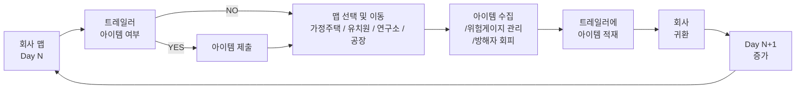

게임이 다음 목적지를 정해 주지 않는다. 플레이어가 지도에서 직접 고른다.


맵 하나를 끝까지 털면 안전하지만 날짜가 간다. 빨리 나오면 시간은 벌지만 할당량이 모자란다. **매번 얼마나 욕심낼지 플레이어가 정하게 만든 것이 이 게임의 긴장 구조다.** 상점에서 배터리나 시계를 사면 그만큼 코인이 줄어, 그 소비도 같은 저울에 올라간다.


**요구일(Day)** — 정해진 날짜마다 요구 코인량을 검사하고, 미달이면 게임 오버다.

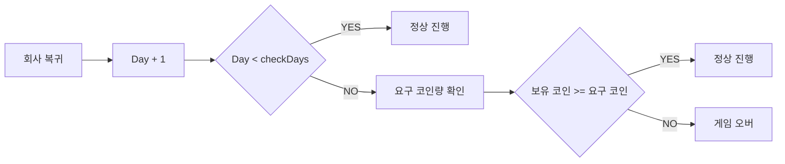

플레이어가 동시에 관리하는 자원은 체력 · 스태미나 · 코인 · 위험게이지 넷이다.


### 플레이어 시스템 — 씬을 넘어가도 살아남는 유일한 오브젝트

플레이어는 이동 · 달리기 · 웅크리기 · 점프로 움직이고, 체력과 스태미나를 소모하며, 4칸 인벤토리를 들고 다닌다. 맵을 옮겨도 파괴되지 않는 유일한 오브젝트라 생명주기 문제가 전부 여기로 모였다.

**씬을 넘어가도 체력이 이전 값 그대로였다.** 파괴되지 않으니 깎인 체력이 그대로 따라온다. 씬 로드 이벤트를 구독해 초기화했다.

```csharp
void OnEnable()  { SceneManager.sceneLoaded += OnSceneLoaded; }
void OnDisable() { SceneManager.sceneLoaded -= OnSceneLoaded; }   // 해제를 짝으로
void OnSceneLoaded(Scene scene, LoadSceneMode mode) => ResetStats();
```

구독은 `OnEnable`, 해제는 `OnDisable`에 짝으로 뒀다. **해제를 빼먹으면 파괴된 오브젝트가 이벤트에 남아 계속 호출된다.** 아래 5장의 씬 전환 버그를 겪고 나서 알게 된 규칙이다.

**스태미나가 0 근처에서 떨렸다.** 임계값이 하나면 0에 닿았다가 조금 차서 다시 달리고 곧바로 0이 되는 일이 프레임 단위로 반복된다. 달리기가 덜덜 끊긴다.

```csharp
if (isRunning) {
    stamina -= staminaDecreaseRate * Time.deltaTime;
    if (stamina <= 0f) { stamina = 0f; exhausted = true; }
} else {
    stamina += staminaRecoveryRate * Time.deltaTime;
    if (exhausted && stamina >= 20f) exhausted = false;   // 0이 아니라 20에서 풀린다
}
```

지치는 값과 풀리는 값을 다르게 뒀다. **0에서 지치고 20에서 풀린다.** 그 사이 구간에서는 버튼을 눌러도 달려지지 않아, 플레이어가 "지금은 못 뛴다"를 몸으로 안다.

### 네 개의 스테이지

맵이 넓을수록 순찰 경로가 길어지고, 경로가 길면 플레이어가 여유를 갖는다. **맵마다 방해자의 순찰 지점 수와 이동 속도를 다르게 잡아 그 여유를 조절했다.**

무서운 이유도 맵마다 다르다. 가정주택은 벽이 많아 모퉁이를 돌기 전까지 뭐가 있는지 모르고, 공장은 멀리까지 보이는 대신 숨을 곳이 없다.

| 스테이지 | 공간의 성격 |
|---|---|
| 가정주택 | 방이 나뉘어 있어 시야가 짧다 |
| 유치원 | 낮은 가구가 많아 웅크림이 유효하다 |
| 연구소 | 감시 카메라가 깔려 있다. 시야 안에 3초 이상 머물면 경비원이 온다 |
| 공장 | 야적장과 외곽 두 구역. 넓게 트여 멀리 보이는 대신 엄폐물이 컨테이너뿐이고, 순찰 경로가 길어 타이밍을 재야 한다 |

| | |
|---|---|
| 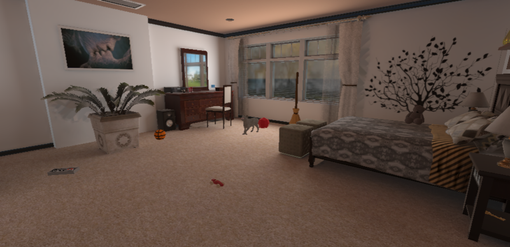 | 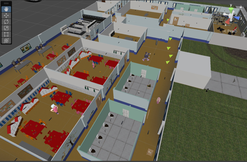 |
| 가정주택 — 방이 나뉘어 시야가 짧다 | 유치원 — 낮은 가구가 많다 |
| 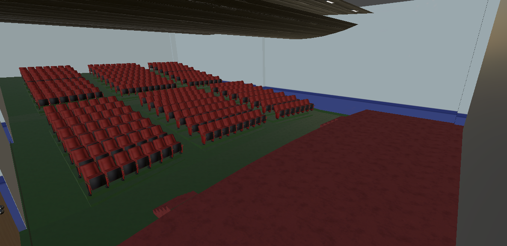 | 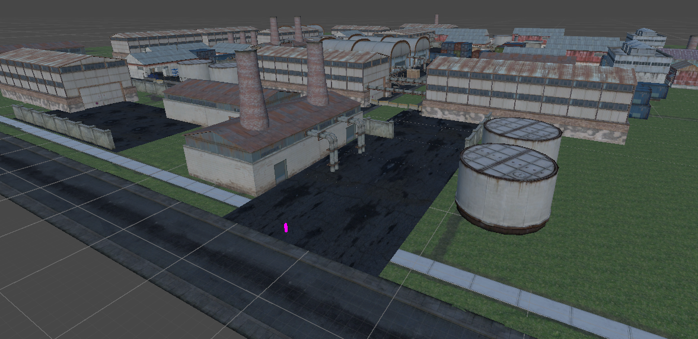 |
| 공장 야적장 — 컨테이너가 유일한 엄폐물 | 공장 외곽 — 순찰 경로가 길다 |

### 위험게이지 — 눈이 아닌 귀로

잠입 중인 플레이어는 화면 구석의 막대를 보지 않는다. 적을 보고 있고, 다음에 어디로 숨을지 생각한다. **그래서 위험도를 소리로 옮겼다.**

업무 구역 밖에 있으면 게이지가 차오르고, 안으로 들어가면 줄어든다. 값이 오를수록 틱 간격이 좁아지고 볼륨이 커진다.

| 게이지 | 틱 간격 | 볼륨 |
|---|---|---|
| 0 ~ 30% | 1.5초 | 0 → 0.5 |
| 30 ~ 70% | 1.5 → 0.7초 | 0.5 → 0.7 |
| 70 ~ 90% | 0.7 → 0.3초 | 0.7 → 1.0 |
| 90 ~ 100% | **0.3 → 0.2초** | 1.0 |

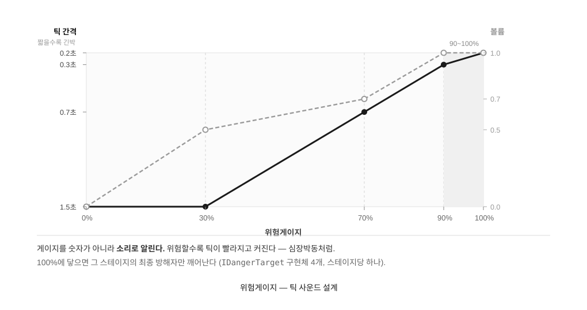

값에 정비례해 간격을 줄이면 플레이어는 변화를 알아채지 못한다. 단계가 바뀌는 순간이 있어야 몸이 반응한다. 경계 수치는 플레이테스트로 조정했다.

**100%에 닿으면 그 스테이지의 최종 방해자가 깨어나 즉사 공격을 한다.** 업무 구역 안으로 도망쳐도 쫓아 들어온다. 플레이어가 믿고 있던 규칙을 마지막에 깨는 장치다.

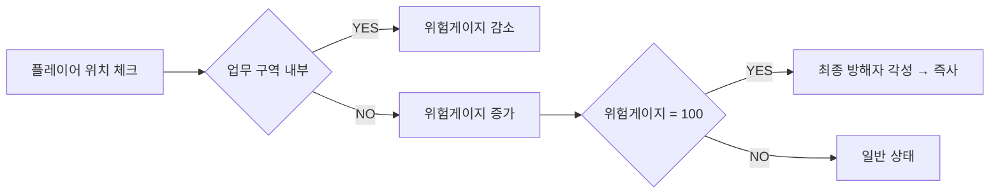

방해자를 깨우는 방식은 스테이지마다 다르다. 게이지가 그 차이를 전부 알게 만들면 스테이지를 추가할 때마다 게이지를 고쳐야 한다. 그래서 게이지는 **다 찼다는 사실만 통보**하고, 무슨 일이 일어날지는 각 방해자가 정한다.

```csharp
public interface IDangerTarget { void OnDangerGaugeMaxed(); }
// 구현: Mom(가정주택) · Director(유치원) · Doctor(연구소) · FactoryManager(공장)
```

```csharp
// AreaGaugeController — 인스펙터에 꽂아준 대상에게 통보만 한다
[SerializeField] private MonoBehaviour targetMonsterBehaviour;
void Awake() { targetMonster = targetMonsterBehaviour as IDangerTarget; }
...
if (targetMonster != null) targetMonster.OnDangerGaugeMaxed();
```

같은 신호를 받고 각자 다르게 반응한다. `Mom`은 `State.Alert`로 바뀌며 `agent.speed = 12f` · `damageAmount = 150f`, `Director`는 경보음을 재생하고, `Doctor`는 `alertSpeed`로 가속한다. **맵을 붙일 때 게이지 코드는 손대지 않고 인스펙터에서 그 맵의 방해자를 꽂았다.**

### AI 방해자 — 발각되기까지의 3초

잠입 게임에서 제일 화가 나는 순간은 **왜 들켰는지 모를 때**다. 그래서 방해자는 전부 무엇을 하면 들키는지가 플레이 중에 드러나도록 만들었다. 엄마는 접근하면 공격하고, 곰인형은 웅크리지 않은 플레이어만 공격하며, 선생님은 순찰과 감시 두 모드를 오간다.

**즉시 발각되지 않는다.** 연구소의 CCTV는 플레이어를 보는 순간 경비원을 부르지 않는다. 시야 안에 3초 이상 머물러야 호출이 나간다. 스쳐 지나가는 것과 들키는 것을 구분해 주지 않으면, 플레이어는 자기가 무엇을 잘못했는지 모른 채 쫓기게 된다.

```csharp
// CCTV.cs — 감지는 CCTV가, 추격은 경비원이 한다
if (IsPlayerInView())
{
    detectionTimer += Time.deltaTime;
    if (detectionTimer >= requiredStayTime)   // 3초
    {
        targetGuard.StartChase(playerTransform);
        detectionTimer = 0f;
    }
}
else detectionTimer = 0f;              // 시야를 벗어나면 리셋
```

감지하는 객체와 쫓아오는 객체를 분리해서, **CCTV를 피하는 것만으로 추격을 끊을 수 있게** 했다.

연구소 CCTV는 경비원을, 가정주택 카메라는 개를, 공장 포탑은 경비 로봇을 부른다. 세 맵에서 같은 구조를 반복했다. 규칙이 일정해야 플레이어가 배울 수 있다고 판단했다.

**상태 집합이 곧 방해자의 성격**

몬스터마다 상태 집합을 따로 정의했다. 같은 FSM을 돌려쓰지 않고, 그 몬스터가 실제로 할 수 있는 행동만 넣었다.

| 스테이지 | 몬스터 | 상태 |
|---|---|---|
| 가정주택 | Mom | `None · Patrol · Chase · Return · Alert` |
| | Dog | `Patrol · Chase · Return · Called` |
| | BlueEyeCat / RedEyeCat | `Patrol · Aggressive (· Return)` |
| 유치원 | Director | `Greeting · Patrol · Chase · Alert` |
| | DollMonster | `Patrol · Chase` |
| 연구소 | SecurityGuard | `Patrol · CCTV · Chase` |
| | Doctor | `Patrol · Chase · Alert` |
| | Researcher | `Idle · Chase · Return` |
| 공장 | GuardRobot | `Idle · MovingToTurret · Patrolling · Chasing` |
| | FactoryManager | `Patrol · Chase · Alert` |

공통 부모 클래스를 두지 않았다. 상태 구성이 서로 달랐기 때문이다. `SecurityGuard`의 `CCTV`는 게임 내 시각에 따른 근무 교대고, `Mom`의 `None`은 첫 대사가 나오는 동안 `Update`를 통째로 멈추는 상태이며, `Dog`의 `Called`는 반려동물 카메라가 부르면 합류하는 상태다. **상태 이름이 곧 그 몬스터의 성격이다.**

`Mom` · `Dog` · `BlueEyeCat` · `Researcher` 넷만 `Return`을 가진다. 추격을 포기하고 제자리로 돌아가는 상태다. 이게 없으면 한 번 들킨 플레이어는 맵이 끝날 때까지 쫓긴다. **곰인형에는 일부러 넣지 않았다. 물러서지 않는 적이 하나는 있어야 했다.** 상태를 빼는 것도 설계다.

`enum State`를 갖지 않는 방해자도 있다. `Teacher`(순찰형/고정형) · `SmartKidAI`(수학 문제로 조작 차단) · `Security_A`/`Security_B` · `TurretSentinel` · `WeldingRobot` · `DroneAI` · `CCTV` · `PetCCTV` · `Trap`은 상태 기계 대신 조건 판정과 타이머로 동작한다. `SmartKidAI`는 아이가 낸 수학 문제를 풀 때까지 조작을 막는다. 쫓아오지 않는데도 위험한 방해자다.

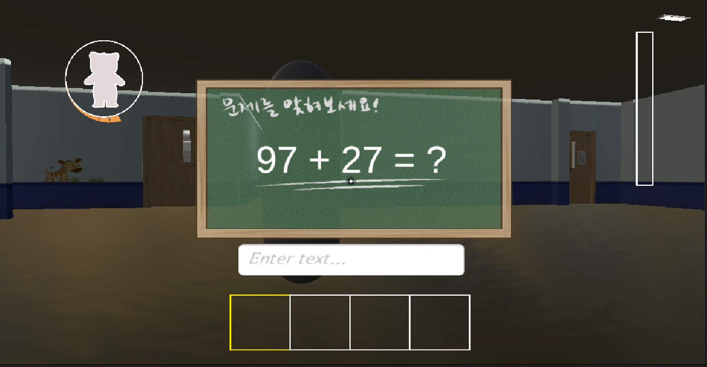

<details>
  <summary><b>가정주택 맵 몬스터</b></summary>

  
</details>

<details>
  <summary><b>유치원 맵 몬스터</b></summary>

  
</details>

<details>
  <summary><b>공장 맵 몬스터</b></summary>

  
  
</details>

### 아이템과 상호작용

인벤토리는 4칸이다. 소지 제한이 있어야 무엇을 버릴지 고르게 된다.

배터리는 들면 속도가 오르고 내려놓으면 돌아온다. 시계는 들면 게임 내 시각이 뜨고, 열쇠는 특정 문에서만 통한다. 효과가 제각각인데 **인벤토리는 그걸 모른다.**

```csharp
public interface IInventoryEffect
{
    void OnAdd(PlayerController player);      // 인벤토리에 집어넣을 때
    void OnRemove(PlayerController player);   // 인벤토리에서 뺄 때
}
```

```csharp
// Inventory — 넣고 빼는 자리에서 인터페이스로만 묻는다
if (item is IInventoryEffect effect) effect.OnAdd(player);
if (itemToRemove is IInventoryEffect e2) e2.OnRemove(player);

// 아이템은 각자 자기 효과만 안다
class SpeedBoostItem : Item, IInventoryEffect {
    public void OnAdd(PlayerController p)    { p.isSpeedItemActive = true;  }
    public void OnRemove(PlayerController p) { p.isSpeedItemActive = false; }
}
```

아이템을 추가할 때 `Inventory`는 고치지 않는다. `Item`을 상속하고 인터페이스를 붙이면 끝이고, **넣을 때와 뺄 때가 짝이라 효과가 걸린 채 남는 일도 없다.** 위험게이지의 `IDangerTarget`과 같은 패턴이 두 번째로 나온 자리다.

- **레버 → 기계 → 코인** — 레버를 당기면 기계가 돌고, 일정 시간 뒤 코인으로 환산된다
- **열쇠 문 · 시간제한 문** — `KeyDoor`는 열쇠를 요구하고, `SpecialDoor`는 열려 있는 시간이 정해져 있다
- **시계 · 속도 아이템** — 상점에서 코인을 주고 사는 소모품
- **랜덤 스포너** — `Physics.CheckSphere`로 겹침을 검사한 뒤 배치한다. 고정 시드 옵션을 둬서 같은 배치를 다시 만들 수 있게 했다


### 진행 및 상태 관리

- **세이브/로드** — `SaveLoadManager` · `SaveData` · `ContinueLoader` · `NewGameInitializer`
- **전역 상태** — `GlobalState` · `Bootstrapper`. 씬을 넘어가도 유지해야 하는 것과 초기화해야 하는 것을 나눈다
- **로딩 씬** — `SceneLoader` · `LoadingSceneController`
- **설정** — 밝기 · 볼륨 · 창 모드. URP 볼륨으로 밝기를 조절한다


여기서 문제가 하나 터졌다. 씬을 넘어갈 때마다 아이템이 사라졌다. → [5장 트러블슈팅](#5)

---

<a id="4"></a>
## 4. 사운드 디자인

3D 게임이라 소리가 위치와 방향에 따라 다르게 들린다. 상황별 재생 스크립트와 음원을 함께 설계했다.

**분류** — `AMB` 환경음 · `CHR` 플레이어가 내는 소리 · `EVT` 이벤트 · `MON` 방해자 · `SFX` 효과음 · `BGM` · `UI` (총 58개)

| | |
|---|---|
| 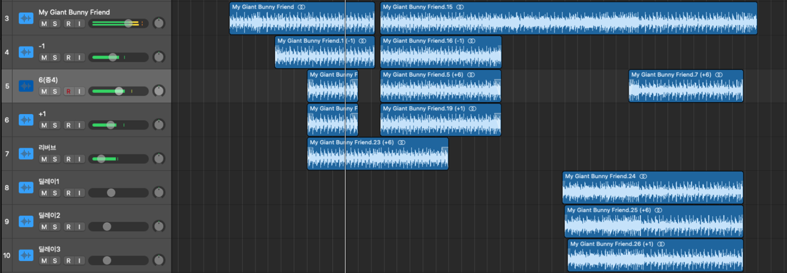 | 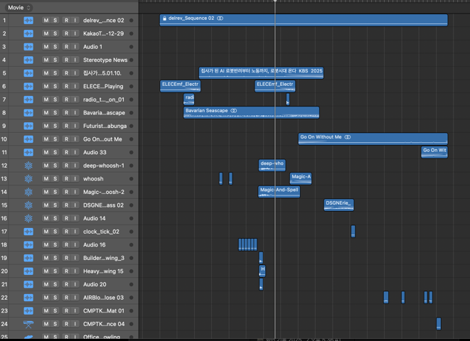 |
| 인트로 — 뉴스 음성 · 기계음 · 발소리 · 앰비언스를 25개 트랙으로 쌓았다 | 유치원 배경음악 — 같은 동요를 단2도, 이어서 증4도로 겹쳤다 |

**유치원 배경음악 — 동요를 무너뜨리는 방식**

동요 한 곡을 기준으로 삼고, 그 위에 같은 곡을 **단2도** 올려 겹쳤다. 두 곡의 주파수를 미세하게 어긋나게 해 불안을 만들고,
그다음에는 **증4도** — 가장 불안정한 음정 — 로 같은 동요를 한 번 더 겹쳤다.
그리고 **모든 음악을 끊는다.** 공백 자체가 공포가 된다. 공백이 끝나면 전곡이 한꺼번에 돌아온다.

**위험게이지 틱** — 3장의 4구간 표가 그대로 사운드 설계다. 소리를 만든 사람이 재생 시점까지 코드로 정했기 때문에, 간격을 0.2초까지 좁히는 판단과 그 소리를 만드는 작업이 한 사람 머릿속에서 나왔다.

**발소리** — 바닥 재질별로 변주를 두고, 이동 속도 3단계에 따라 간격을 바꾸며, 발이 닿는 순간 카메라를 흔든다.

**상호작용 음향 연쇄** — 레버를 당기면 기계 회전음이 먼저 나고, 일정 시간 뒤 코인 소리가 이어진다. 소리의 순서로 인과를 만든다.

**컷신 · 인트로** — Foley 기법과 디지털 신스를 병행해 제작하고, 움직임 · 카메라 컷 · 장면 전환에 타이밍을 맞췄다.
경진대회 전시 부스용 **9컷 홍보 영상**도 함께 제작했다.

---

<a id="5"></a>
## 5. 트러블슈팅 — 씬을 넘어갈 때 아이템이 사라졌다

플레이어는 회사 → 가정주택 → 유치원 → 공장을 오가며 **매번 씬을 새로 로드**한다.
그런데 Unity는 씬을 언로드할 때 그 씬에 속한 오브젝트를 전부 파괴한다.
**들고 있던 아이템도, 트레일러에 실어 둔 아이템도 같이 사라졌다.**

원인이 하나가 아니었다. 네 겹이었다.

**① `DontDestroyOnLoad`는 루트 오브젝트에만 걸린다**

자식 오브젝트에 호출하면 **조용히 무시되고 부모와 함께 죽는다.** 아이템은 씬 오브젝트의 자식이었다.
분리를 먼저 해야 했다.

```csharp
// Inventory.TryPickupItem
go.transform.SetParent(null);   // 루트로 분리해야 DDOL이 걸린다
DontDestroyOnLoad(go);
go.SetActive(false);            // 들고 있는 상태 = 화면에서 감춤
```

**② 트레일러에 실은 아이템은 자식이라 또 사라졌다**

트레일러에 담으면 자식이 되는데, 자식이 되는 순간 ①의 함정에 다시 걸린다.
자식으로 넣으면서 **동시에 그 아이템 자신도 보호**하도록 했다.

```csharp
// CarTrigger.OnTriggerEnter
other.transform.SetParent(transform);
DontDestroyOnLoad(other.gameObject);   // 자식 아이템도 보호
```

**③ 씬을 다시 로드하면 트레일러가 두 개가 된다**

살아남은 트레일러와 새 씬에 배치된 트레일러. 아이템이 어느 쪽에 붙는지가 매번 달랐다.
`scene.name`으로 **누가 원본인지** 판별했다.

```csharp
if (t != gameObject && t.scene.name == "DontDestroyOnLoad")
{
    Destroy(gameObject);   // 나는 새로 로드된 쪽 → 사라진다
    yield break;
}
```

**④ 그리고 순서 — 이게 제일 까다로웠다**

중복 판정이 끝나기 **전에** 트리거가 발동하면, 곧 파괴될 트레일러에 아이템이 붙는다.
초기화가 끝나기 전 입력을 막는 플래그를 뒀다.

```csharp
private bool isValid = false;

IEnumerator Start()          // Awake가 아니라 Start
{
    yield return null;       // 한 프레임 대기 — 기존 DDOL 오브젝트가 먼저 인식되도록
    ...
    isValid = true;
}

void OnTriggerEnter(Collider other)
{
    if (!isValid) return;    // 아직 준비 안 됐으면 받지 않는다
```

---

**같은 뿌리에서 나온 문제들**

| 증상 | 대응 |
|---|---|
| 씬을 넘어가도 체력·게이지가 이전 값 그대로 | `PlayerController.OnSceneLoaded` → `ResetStats()` 구독 |
| 새 게임을 시작해도 이전 판 오브젝트가 남음 | `GlobalState.KillAllDontDestroyOnLoad()` — DDOL 씬 루트 전부 제거 |
| 오브젝트는 지웠는데 `static Instance`가 살아 있음 | `Bootstrapper.EnsureAfterNewGame()`에서 수동 `null` 대입 |
| 초기화 순서가 어긋남 | `[DefaultExecutionOrder(-3000)]` — `MapTracker`(-1000)보다 먼저 |

<sub>이 표의 대응 중 `GlobalState`와 `Bootstrapper`는 권예진이 작성한 파일이다. 증상을 좁히고 어디에 무엇을 걸어야 하는지 정하는 과정은 함께했다.</sub>

**못 잡은 버그도 있다.** `Day`가 0으로 되돌아가는 현상이 있었는데 어디서 그러는지 찾지 못했다.
그래서 대입되는 순간의 호출 스택을 찍게 했다.

```csharp
set {
    _currentDay = value;
    if (value == 0)
        Debug.Log("[MapTracker] currentDay가 0으로 설정됨!\n" + System.Environment.StackTrace);
}
```

원인을 잡을 때까지 사용자에게 영향이 가지 않도록, `Company` 진입 시 `Day`를 1로 올리는 **임시 방어**를 따로 뒀다.
코드에도 "응급 패치"라고 적어 두었다 — 나중에 이게 정상 로직으로 오해되지 않도록.

> **배운 것** — 오브젝트의 수명이 씬의 수명에 묶여 있다는 것,
> 그리고 그 사슬이 `부모-자식` → `중복 인스턴스` → `초기화 순서` → `static 상태 잔존`으로 이어진다는 것.

---

<a id="6"></a>
## 6. 코드 구조

### 시스템별 담당

| 시스템 | 담당 | 내용 |
|---|---|---|
| **플레이어 · 인벤토리** | **이종하** | `PlayerController` 싱글톤 · 피격 연출(카메라 흔들림 · 화면 플래시 · 사운드) · 발소리 · 동적 조준점 · 스태미나 히스테리시스 · 4칸 인벤토리와 `IInventoryEffect` |
| **위험게이지** | **이종하** | 채움/감소 · 4구간 틱 사운드 · `IDangerTarget` 설계 &nbsp;<sub>게이지 UI는 권예진</sub> |
| **방해자 AI**<br><sub>가정주택 · 유치원 · 연구소</sub> | **이종하** | 방해자 11종 가운데 **8종을 직접 구현**했다. `Mom` · `Director` · `Teacher`(순찰형/고정형, 시야각 60°) · `DollMonsterAI`(웅크리면 미감지) · `SmartKid` 계열(수학 문제로 조작 차단) · `Doctor` · `Researcher` · `SecurityGuard`(게임 내 시각 근무 교대) · `CCTV`(3초 유예 후 경비원 호출) &nbsp;<sub>유치원 계열은 김도현이 만든 파일 위에 이어 작업했고, `TeacherManager`는 김도현 단독</sub> |
| **방해자 AI**<br><sub>공장</sub> | **권예진** · **이종하** | 권예진 — `GuardRobot` · `DroneAI` · `DronePatrol` · `WeldingRobot` · `TurretSentinel` · `FlameProjectile`(초당 피해 발사체 + URP 화염 VFX)<br>이종하 — `FactoryManager` · `Security_A` · `Security_B`(플래시로 시야 마비)<br>공동 — `Trap`(조작 금지 + 블랙 화면 점멸) |
| **상호작용 · 경제** | **이종하** | 레버 → 기계 → 코인 환산 · 열쇠/시간제한 문 · 시계·속도 아이템 · 겹침 검사 랜덤 스포너 |
| **사운드 · 연출** | **이종하** | 3D 공간 음향 설계 · 58개 제작 · 배경음악 작곡 · 컷신 Foley · 홍보 영상 |
| **세이브 · 부팅 · 전역 상태** | **권예진** | 314줄짜리 `SaveLoadManager` · `SaveData` · `ContinueLoader` · `NewGameInitializer` · **`Bootstrapper`** · **`GlobalState`**. 5장 트러블슈팅에서 쓰는 `KillAllDontDestroyOnLoad()`와 `EnsureAfterNewGame()`이 여기서 나왔다 |
| **거점 UI · 상점** | **권예진** | 맵 선택 · 상점(`StorePanelController` · `StoreItemUI` · `WarningUI`) · `DayManager` / `DayUI` · `CoinUI` · 아이템 전달 알림 · 시작 화면 · 일시정지 메뉴 |
| **환경 설정** | **권예진** | URP 볼륨 밝기 · 오디오 볼륨 · 창 모드. 설정값을 부팅 시 복원하는 `DisplayBoot` / `VolumeBoot` 포함 |
| **그래픽** | **김도연** | 모델링 · 텍스처 · UI 아트. 스크립트가 아니라 에셋 쪽 작업이라 이 저장소의 줄 수에는 거의 잡히지 않는다 |
| **저장소 운영** | **김도현** | 2025년 4월부터 7월까지 참여. 브랜치·머지 관리와 `3.Monster` 폴더 스테이지별 재편, 유치원 방해자 계열과 `SaveLoadUI`의 초기 구현 |

<sub>줄 소유 기준(`git blame`, `Assets/1.Script`) — 이종하 5,332 · 권예진 3,795 · 김도현 699 · 김도연 39.
파일을 만든 사람과 지금 그 줄을 갖고 있는 사람이 다른 경우가 있어, 둘을 함께 보고 정리했다.</sub>

### 기술 스택


| 패키지 | 버전 | 목적 |
|--------|------|------|
| Universal Render Pipeline | 14.0.11 | 그래픽 렌더링 |
| AI Navigation | 1.1.7 | NavMesh 기반 AI |
| TextMesh Pro | 3.0.9 | 텍스트 렌더링 |
| Timeline | 1.7.6 | 시네마틱 연출 |
| Visual Scripting | 1.9.4 | 노드 기반 스크립팅 |

IDE는 Visual Studio / Rider, 버전 관리는 Git, 사운드는 Logic Pro X를 썼다.

### 폴더 구성

`Assets/1.Script` 기준 94개 파일 · 9,862줄. 외부 에셋에 딸려 온 스크립트는 제외한 수치다.

| 폴더 | 파일 | 줄 | 내용 |
|---|---:|---:|---|
| `3.Monster/` | 30 | 4,376 | 방해자 AI. 스테이지별 하위 폴더 |
| `Map/` | 10 | 1,108 | 위험게이지 · 씬 전환 · 문 · DDOL |
| `1.Player/` | 8 | 1,080 | 조작 · 인벤토리 · 발소리 · 피격 |
| `Navigation/` | 12 | 1,010 | 회사 거점 UI(맵 선택 · 상점 · Day) |
| `2.Items/` | 10 | 698 | 아이템과 효과 · 랜덤 스포너 |
| `Settings/` | 7 | 439 | 밝기 · 볼륨 · 창 모드 |
| `Save/` | 5 | 435 | 세이브/로드 |
| `UI/` | 4 | 308 | 알림 · 안전구역 표시 |
| `StartGame/` | 4 | 195 | 시작 화면 · 전역 상태 |
| `4.loading/` | 2 | 114 | 로딩 씬 |
| 루트 | 2 | — | `Bootstrapper.cs` · `IntroVideoPlayer.cs` |

<details>
<summary><b>전체 스크립트 트리 펼치기</b></summary>

```
Assets/
├── 0.Scenes/
│   ├── Intro.unity              # 오프닝
│   ├── GameStart.unity          # 시작 화면
│   ├── Company.unity            # 거점 — 임무 수령과 제출
│   ├── FamilyHouse.unity        # 스테이지: 가정주택
│   ├── Kindergarten.unity       # 스테이지: 유치원
│   ├── Factory.unity            # 스테이지: 공장
│   ├── etc.unity
│   ├── LoadingScene.unity
│   └── GameOver.unity
│
├── 1.Script/
│   ├── Bootstrapper.cs                  # [DefaultExecutionOrder(-3000)] 초기화 진입점
│   ├── IntroVideoPlayer.cs
│   │
│   ├── 1.Player/
│   │   ├── PlayerController.cs          # 이동 · 달리기 · 웅크리기 · 스태미나 · 체력
│   │   ├── Inventory.cs                 # 4칸 인벤토리 · 씬 전환 시 아이템 보호
│   │   ├── InventoryUI.cs
│   │   ├── FootstepController.cs        # 바닥 재질 · 속도 3단계별 발소리
│   │   ├── Damage.cs
│   │   ├── CrossHair.cs                 # 동적 조준점
│   │   ├── GameOverControl.cs
│   │   └── Text.cs
│   │
│   ├── 2.Items/
│   │   ├── Item.cs
│   │   ├── IInventoryEffect.cs          # OnAdd / OnRemove
│   │   ├── ClockItem.cs · SpeedBoostItem.cs · HealthItem.cs
│   │   ├── KeyItem.cs · ArrowItem.cs
│   │   ├── Lever.cs · PlaneItemToCoin.cs    # 레버 → 기계 → 코인
│   │   └── RandomItemSpawner.cs         # 겹침 검사 후 배치
│   │
│   ├── 3.Monster/
│   │   ├── Monster.cs
│   │   ├── IDangerTarget.cs             # void OnDangerGaugeMaxed();
│   │   ├── BabyAI.cs
│   │   │
│   │   ├── FamilyHouse/
│   │   │   ├── Mom.cs                   # IDangerTarget 구현
│   │   │   ├── Dog.cs · PetCCTV.cs      # 반려동물 카메라가 개를 호출
│   │   │   └── BlueEyeCat.cs · RedEyeCat.cs
│   │   │
│   │   ├── kindergarten/
│   │   │   ├── Director.cs              # IDangerTarget 구현
│   │   │   ├── DollMonsterAI.cs         # 웅크리면 미감지
│   │   │   ├── Teacher.cs · TeacherManager.cs
│   │   │   └── SmartKid/
│   │   │       ├── SmartKidAI.cs
│   │   │       ├── ProblemManager.cs · MathProblemUI.cs
│   │   │       └── PlayerInputBlocker.cs
│   │   │
│   │   ├── laboratory/
│   │   │   ├── Doctor.cs                # IDangerTarget 구현
│   │   │   ├── SecurityGuard.cs · CCTV.cs
│   │   │   └── Researcher.cs
│   │   │
│   │   └── Factory/
│   │       ├── FactoryManager.cs        # IDangerTarget 구현
│   │       ├── Security_A.cs · Security_B.cs
│   │       ├── GuardRobot.cs · TurretSentinel.cs
│   │       ├── DroneAI.cs · DronePatrol.cs · WeldingRobot.cs
│   │       └── FlameProjectile.cs · Trap.cs
│   │
│   ├── Map/
│   │   ├── AreaGaugeController.cs       # 위험게이지 본체
│   │   ├── AreaGaugeUI.cs · RedOverlay.cs
│   │   ├── MapTracker.cs                # [DefaultExecutionOrder(-1000)]
│   │   ├── CarTrigger.cs                # 트레일러 적재
│   │   ├── DontDestroyOnLoadObject.cs
│   │   ├── SceneChanger.cs · SkyboxChanger.cs
│   │   └── KeyDoor.cs · SpecialDoor.cs  # 열쇠 문 · 시간제한 문
│   │
│   ├── Navigation/
│   │   ├── NavigationInteract.cs
│   │   ├── MainPanel/                   # CoinUI · DayManager · DayUI 등
│   │   ├── MapPanel/                    # 맵 선택
│   │   └── StorePanel/                  # 상점
│   │
│   ├── Save/
│   │   ├── SaveLoadManager.cs · SaveData.cs
│   │   ├── SaveLoadUI.cs · ContinueLoader.cs
│   │   └── NewGameInitializer.cs
│   │
│   ├── StartGame/
│   │   ├── GlobalState.cs               # KillAllDontDestroyOnLoad()
│   │   ├── StartMenu.cs · StartSceneManager.cs
│   │   └── GameOverUI.cs
│   │
│   ├── UI/                              # 알림 · 안전구역 표시
│   ├── Settings/                        # 밝기 · 볼륨 · 창 모드
│   └── 4.loading/                       # SceneLoader · LoadingSceneController
│
├── 3.Sound/                             # AMB CHR EVT MON SFX BGM UI
└── 2.Download/ 외                        # 외부 구매·무료 에셋
```

</details>

---

<a id="7"></a>
## 7. 설치 및 실행

<details>
<summary><b>펼쳐보기</b></summary>

### 요구사항

- **Unity 2022.3.47f1**
- **Visual Studio** 또는 **Rider**

### 실행

```bash
git clone https://github.com/hitori839/DelRev.git
```

1. Unity Hub에서 `DelRev` 폴더를 프로젝트로 연다 (2022.3.47f1)
2. Unity가 `Packages/manifest.json`에서 패키지를 자동으로 내려받는다
3. `Assets/0.Scenes/Intro.unity`를 열고 Play

### 조작

| 키 | 기능 |
|-------|------|
| `WASD` | 이동 |
| `Space` | 점프 |
| `Shift` | 달리기 (스태미나 소모) |
| `Ctrl` | 웅크리기 — 발소리가 줄어든다 |
| `Mouse` | 카메라 회전 |
| `ESC` | 메뉴 |

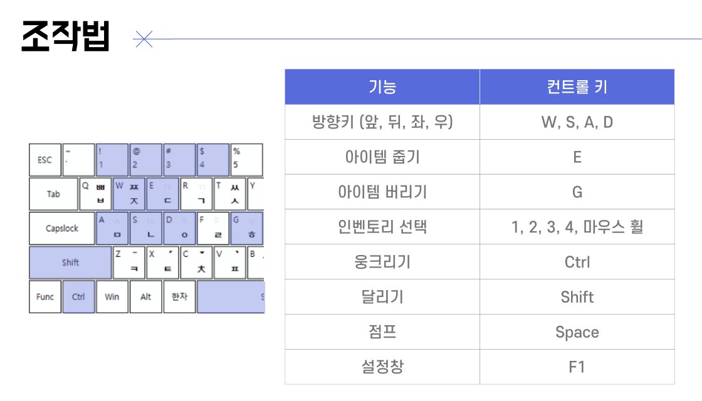

</details>

---

<a id="8"></a>
## 8. 수상 내역

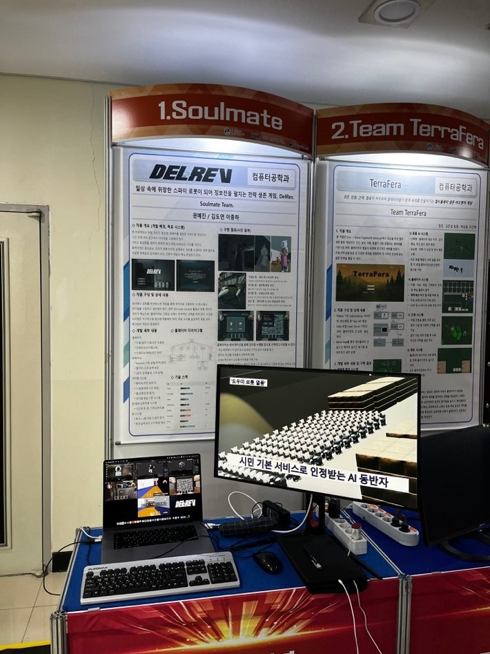

### 2025 RIEF-FESTA 캡스톤디자인 경진대회 (G7 부문) — 장려상

- **주관:** 단국대학교 G-RISE 사업단
- **선정:** 총 75팀 중 6팀 (대상 · 우수 · 장려)

<details>
  <summary><b>상장 펼쳐보기</b></summary>

  
</details>

### 2025 단국대학교 SW중심대학 캡스톤 페스티벌 — 장려상

- **팀명:** Soulmate
- **주관:** 단국대학교 SW중심대학사업단
- **선정:** 총 100팀 중 15팀 (대상 · 최우수 · 우수 · 장려)

<details>
  <summary><b>상장 펼쳐보기</b></summary>

  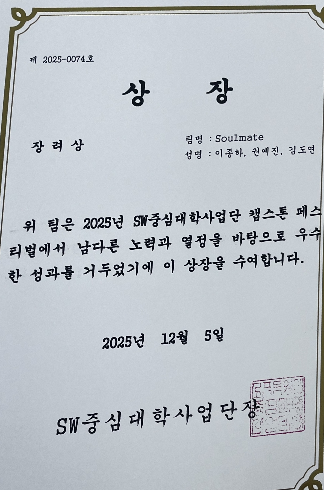
</details>

### 제출 문서

발표와 심사에 실제로 낸 자료다. 저장소 `docs/`에 원본이 있다.

| 자료 | 파일 |
|---|---|
| 발표자료 | [presentation.pdf](docs/presentation.pdf) |
| 포스터 — RIEF-FESTA | [poster-rief-festa.jpg](docs/poster-rief-festa.jpg) |
| 포스터 — SW 캡스톤 | [poster-capstone.pdf](docs/poster-capstone.pdf) |
