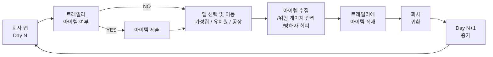

# DelRev 🎮

<div align="center">

**다양한 배경과 AI 몬스터들로부터 도망치며 생존하는 풀-3D 스텔스 서바이벌 게임**

[](https://unity.com)
[](https://docs.microsoft.com/en-us/dotnet/csharp/)
[](LICENSE)
[]()

</div>


## 📚 목차
|순번|항목|
|:---:|:-------------------:|
| 1️ | 📌 [프로젝트 개요](#1) |
| 2 | 👥 [개발 팀](#2) |
| 3 | ✨ [주요 기능](#3) |
| 4 | 🛠️ [기술 스택](#4) |
| 5 | 🎮 [게임 화면 및 데모](#5) |
| 6 | 📁 [프로젝트 구조](#6) |
| 7 | 🕹️ [설치 및 실행](#7) |
| 8 | 🏆 [수상 내역](#8) |
| 9 | 📜 [개선사항 및 라이센스](#9) |

---

<a id="1"></a>
## 1️⃣ 📌 프로젝트 개요

**플레이어는 가정용 도우미 로봇으로 위장한 스파이 로봇입니다.**

두 헤지펀드 A사와 B사가 대립합니다. A사는 경쟁사 내부 정보를 얻기 위해, 가정용 로봇의 외형과 기능을 그대로 유지한 채 정보 수집과 침투가 가능하도록 프로그래밍된 도우미 로봇을 만듭니다. 그 로봇이 플레이어입니다.

**DelRev**는 이 로봇이 가족 주택 · 유치원 · 연구소 · 공장에 들어가 임무를 수행하고, 고유한 AI를 가진 방해자들에게서 도망치며 생존하는 풀 3D 스텔스 서바이벌 게임입니다.

플레이어는 **체력/스테미나**뿐 아니라, 게임의 핵심 자원인 **위험게이지**를 관리하며 은신과 이동 전략을 세워야 합니다.  
각 스테이지는 독특한 배경과 특화된 AI 몬스터들을 특징으로 하며, **위험게이지를 낮게 유지하기 위한 스텔스 전술**, 아이템 수집, 상황 판단이 생존의 핵심입니다.

- **개발 기간:** 2025.04 – 2026.01 (첫 커밋 ~ 마지막 개발 커밋)
- **개발 엔진:** Unity 2022.3.47f1  
- **개발 언어:** C#
- **플랫폼**: PC (Windows/macOS)

<details>
  <summary> 📊 상세 통계 </summary>

  | | |
  |---|---|
  | 팀 작성 스크립트 | `Assets/1.Script` 기준 **94개 파일 · 9,862줄** |
  | 저장소 커밋 | **234커밋** (전 브랜치 기준) |
  | 게임 씬 | 8개 |
  | 방해자 AI | **8종** (가족주택 3 · 유치원 4 · 연구소 3 · 공장 5, 일부 공용) |
  | 사운드 | 58개 (`AMB` `CHR` `EVT` `MON` `SFX` `BGM` `UI`) |

  <sub>`Assets/2.Download` 등 외부 구매·무료 에셋에 포함된 스크립트는 제외한 수치입니다.</sub>

</details>

---

<a id="2"></a>
## 2️⃣ 👥 개발 팀

| 이름 | 권예진 | 김도연 | 김도현 | 이종하 |
|:---:|:---:|:---:|:---:|:---:|
|역할| Client Dev<br/> UI/UX Design | Graphic Design | Client Dev | Client Dev <br/> Sound Design |
| Github | <a href="https://github.com/yejinkw"></a> | <a href="https://github.com/doyeon112"></a> | <a href="https://github.com/hitori839"></a> | <a href="https://github.com/bell-ha"></a> |

<br>

### 시스템별 담당

| 시스템 | 담당 | 내용 |
|---|---|---|
| **플레이어** | **이종하** | `PlayerController` 싱글톤 · 피격 연출(카메라 흔들림 · 화면 플래시 · 사운드) · 발소리 · 동적 조준점 · 씬 전환 시 스탯 초기화 |
| **위험게이지** | **이종하** | 채움/감소 · 4구간 틱 사운드 · `IDangerTarget` 설계 &nbsp;<sub>UI는 권예진</sub> |
| **방해자 AI**<br><sub>가족주택 · 유치원 · 연구소</sub> | **이종하** | `Mom` · `Director`(인사→순찰→추격→분노) · `Teacher`(순찰형/고정형, 시야각 60°) · `DollMonsterAI`(웅크리면 미감지) · `SmartKid` 계열(조작 차단 + 수학 문제) · `Doctor` · `Researcher` · `SecurityGuard` |
| **방해자 AI**<br><sub>공장</sub> | **이종하** · **권예진** | 이종하 — `FactoryManager`(순찰→추격→분노) · `Security_A` · `Security_B`(플래시로 시야 마비)<br>권예진 — `GuardRobot` · `DroneAI` · `WeldingRobot` · `TurretSentinel`<br>공동 — `FlameProjectile`(초당 피해 발사체 + URP 화염 VFX) · `Trap`(조작 금지 + 블랙 화면 점멸) |
| **상호작용 · 경제** | **이종하** | 레버 → 기계 → 코인 환산 · 열쇠/시간제한 문 · 시계·속도 아이템 · 겹침 검사 랜덤 스포너 |
| **사운드 · 연출** | **이종하** | 3D 공간 음향 설계 · 58개 제작 · 배경음악 작곡 · 컷신 Foley · 홍보 영상 &nbsp;<sub>↓ 아래 상세</sub> |
| **UI/UX · 세이브 · 상점** | **권예진** | |
| **그래픽** | **김도연** | 모델링 · 텍스처 · UI 아트 |
| **저장소 운영** | **김도현** | 게임 로직 일부 공동 작성 |

<sub>담당 구분은 이종하의 캡스톤 기말 보고서 「III. 나의 기여 내용」과 커밋 이력을 대조해 정리했습니다.<br>
`Mom` · `Teacher` · `PlayerController`는 여러 명이 함께 작성했습니다.</sub>

---

<a id="3"></a>
## 3️⃣ ✨ 주요 기능

### 🎮 게임플레이 시스템 


- **멀티 스테이지 구성**: 5개의 고유한 배경(회사, 공장, 유치원, 가족 주택, 기타) 기반 진행
  
- **스텔스 메커닉**: 조명/음성/거리 감지에 의해 몬스터가 플레이어를 탐지하는 은신 플레이
- **생존 시스템**  
  - 체력 관리(피해/회복)
  - 코인 수집 및 자원 운영
  - 회복/버프 아이템 사용(상황 대응)

- **핵심 자원 관리(게임 핵심 요소)**
  - **체력/스테미나**: 달리기·숨기기 등 행동에 따라 소모/회복되는 생존 자원
    
  - **인벤토리 제한**: 아이템 **최대 4개 소지**로 선택과 집중 유도
  - **위험게이지**: 플레이어의 ‘노출/리스크’를 나타내는 핵심 자원  
    - 특정 조건에서 **위험게이지가 증가/감소**하며, 임계치 도달 시 **치명적 페널티(게임오버급 이벤트)** 발생
    - 게이지가 차오르는 것을 **숫자가 아니라 소리로 알린다.** 틱 간격과 볼륨을 4구간으로 나눠, 위험할수록 심장박동처럼 빨라진다

      | 게이지 | 틱 간격 | 볼륨 |
      |---|---|---|
      | 0 ~ 30% | 1.5초 | 0 → 0.5 |
      | 30 ~ 70% | 1.5 → 0.7초 | 0.5 → 0.7 |
      | 70 ~ 90% | 0.7 → 0.3초 | 0.7 → 1.0 |
      | 90 ~ 100% | **0.3 → 0.2초** | 1.0 |

    - 100% 도달 시 **`IDangerTarget` 인터페이스**로 그 스테이지의 최종 방해자만 깨운다. 스테이지마다 구현이 다르므로 게이지 로직은 몬스터를 몰라도 된다

      ```csharp
      public interface IDangerTarget { void OnDangerGaugeMaxed(); }
      // 구현: Mom(가족주택) · Director(유치원) · Doctor(연구소) · FactoryManager(공장)
      ```
      ```mermaid
        flowchart LR
          A["플레이어 위치 체크"] --> B{"업무장소 내부"}
          B -->|YES| C["위험게이지 감소"]
          B -->|NO| D["위험게이지 증가"]
          D --> E{"위험게이지 = 100"}
          E -->|YES| F["최종 방해자에 의한 즉사"]
          E -->|NO| G["일반 상태"]
        ```

  - **요구일**: 코인 요구 조건을 검사하는 **마감 일자(데드라인)**
    - **일차**(Day)를 기준으로 특정 시점마다 **요구 코인량**이 미달 시 게임 오버 발생
      ```mermaid
        flowchart LR
          A["회사 복귀"] --> B["Day + 1"]
          B --> C{"Day < checkDays"}
          C -->|YES| D["정상 진행"]
          C -->|NO| E["요구 코인량 확인"]
          E --> F{"보유 코인 ≥ 요구 코인"}
          F -->|YES| G["정상 진행"]
          F -->|NO| H["게임 오버"]
        ```

### 🤖 AI 몬스터 시스템
- **스테이지별 고유 몬스터**: 각 스테이지에 맞춘 개성 있는 몬스터와 패턴 설계
- **다양한 행동 유형**: 패트롤/추적/공격/특수 행동 등 상황 기반 행동 변화
- **탐지 메커닉**: 시야각·거리·상황 요소를 활용한 플레이어 인식 로직

몬스터마다 **상태 집합을 따로 정의**했다. 같은 FSM을 돌려쓰지 않고, 그 몬스터가 실제로 할 수 있는 행동만 넣었다.

| 스테이지 | 몬스터 | 상태 |
|---|---|---|
| 가족주택 | Mom | `None · Patrol · Chase · Return · Alert` |
| | Dog | `Patrol · Chase · Return · Called` |
| | BlueEyeCat / RedEyeCat | `Patrol · Aggressive (· Return)` |
| 유치원 | Director | `Greeting · Patrol · Chase · Alert` |
| | DollMonster | `Patrol · Chase` |
| 연구소 | SecurityGuard | `Patrol · CCTV · Chase` |
| | Doctor | `Patrol · Chase · Alert` |
| | Researcher | `Idle · Chase · Return` |
| 공장 | GuardRobot | `Idle · MovingToTurret · Patrolling · Chasing` |
| | FactoryManager | `Patrol · Chase · Alert` |

`SecurityGuard`는 CCTV를 확인하는 상태가, `Dog`는 부름을 받는 상태가, `GuardRobot`은 포탑으로 이동하는 상태가 따로 있다. **상태 이름이 곧 그 몬스터의 성격이다.**

<details>
  <summary><b> 🏠 가정집 맵 몬스터 </b></summary>

  
</details>

<details>
  <summary><b> 👶 유치원 맵 몬스터 </b></summary>

  
</details>

<details>
  <summary><b> 🏭 공장 맵 몬스터 </b></summary>

  
  
</details>

<br/>

### 💾 게임 진행 및 상태 관리 
- **세이브/로드 시스템**: 게임 진행 상황 저장 및 불러오기
- **글로벌 상태 관**: 씬 전환에서도 게임 상태가 유지되는 진행 구조
- **로딩 씬**: 자연스러운 씬 전환 및 플레이 흐름 개선

### 🎨 비주얼 & 그래픽
- **Universal Render Pipeline (URP)**: 최적화된 그래픽 파이프라인 적용
- **Volume Lighting**: 분위기 연출을 위한 조명/볼륨 효과
- **고품질 3D 모델**: 다양한 에셋 활용을 통한 씬 완성도 강화

### 🧩 트러블슈팅 — 씬을 넘어갈 때 아이템이 사라졌다

플레이어는 회사 → 가족주택 → 유치원 → 공장을 오가며 **매번 씬을 새로 로드**한다.
그런데 Unity는 씬을 언로드할 때 그 씬에 속한 오브젝트를 전부 파괴한다.
**들고 있던 아이템도, 트레일러에 실어 둔 아이템도 같이 사라졌다.**

원인이 하나가 아니었다. 네 겹이었다.

**① `DontDestroyOnLoad`는 루트 오브젝트에만 걸린다**

자식 오브젝트에 호출하면 **조용히 무시되고 부모와 함께 죽는다.** 아이템은 씬 오브젝트의 자식이었다.
분리를 먼저 해야 했다.

```csharp
// Inventory.TryPickupItem
go.transform.SetParent(null);   // ← 루트로 분리해야 DDOL이 걸린다
DontDestroyOnLoad(go);
go.SetActive(false);            // 들고 있는 상태 = 화면에서 감춤
```

**② 트레일러에 실은 아이템은 자식이라 또 사라졌다**

트레일러에 담으면 자식이 되는데, 자식이 되는 순간 ①의 함정에 다시 걸린다.
자식으로 넣으면서 **동시에 그 아이템 자신도 보호**하도록 했다.

```csharp
// CarTrigger.OnTriggerEnter
other.transform.SetParent(transform);
DontDestroyOnLoad(other.gameObject);   // 자식 아이템도 보호
```

**③ 씬을 다시 로드하면 트레일러가 두 개가 된다**

살아남은 트레일러와 새 씬에 배치된 트레일러. 아이템이 어느 쪽에 붙는지가 매번 달랐다.
`scene.name`으로 **누가 원본인지** 판별했다.

```csharp
if (t != gameObject && t.scene.name == "DontDestroyOnLoad")
{
    Destroy(gameObject);   // 나는 새로 로드된 쪽 → 사라진다
    yield break;
}
```

**④ 그리고 순서 — 이게 제일 까다로웠다**

중복 판정이 끝나기 **전에** 트리거가 발동하면, 곧 파괴될 트레일러에 아이템이 붙는다.
초기화가 끝나기 전 입력을 막는 플래그를 뒀다.

```csharp
private bool isValid = false;

IEnumerator Start()          // Awake가 아니라 Start
{
    yield return null;       // 한 프레임 대기 — 기존 DDOL 오브젝트가 먼저 인식되도록
    ...
    isValid = true;
}

void OnTriggerEnter(Collider other)
{
    if (!isValid) return;    // 아직 준비 안 됐으면 받지 않는다
```

---

**같은 뿌리에서 나온 문제들**

| 증상 | 대응 |
|---|---|
| 씬을 넘어가도 체력·게이지가 이전 값 그대로 | `PlayerController.OnSceneLoaded` → `ResetStats()` 구독 |
| 새 게임을 시작해도 이전 판 오브젝트가 남음 | `GlobalState.KillAllDontDestroyOnLoad()` — DDOL 씬 루트 전부 제거 |
| 오브젝트는 지웠는데 `static Instance`가 살아 있음 | `Bootstrapper.EnsureAfterNewGame()`에서 수동 `null` 대입 |
| 초기화 순서가 어긋남 | `[DefaultExecutionOrder(-3000)]` — `MapTracker`(-1000)보다 먼저 |

**못 잡은 버그도 있다.** `Day`가 0으로 되돌아가는 현상이 있었는데 어디서 그러는지 찾지 못했다.
그래서 대입되는 순간의 호출 스택을 찍게 했다.

```csharp
set {
    _currentDay = value;
    if (value == 0)
        Debug.Log("[MapTracker] currentDay가 0으로 설정됨!\n" + System.Environment.StackTrace);
}
```

원인을 잡을 때까지 사용자에게 영향이 가지 않도록, `Company` 진입 시 `Day`를 1로 올리는 **임시 방어**를 따로 뒀다.
코드에도 "응급 패치"라고 적어 두었다 — 나중에 이게 정상 로직으로 오해되지 않도록.

> **배운 것** — 오브젝트의 수명이 씬의 수명에 묶여 있다는 것,
> 그리고 그 사슬이 `부모-자식` → `중복 인스턴스` → `초기화 순서` → `static 상태 잔존`으로 이어진다는 것.

### 🔊 사운드 디자인

3D 게임이라 소리가 위치와 방향에 따라 다르게 들립니다. 상황별 재생 스크립트와 음원을 함께 설계했습니다.

**분류** — `AMB` 환경음 · `CHR` 플레이어가 내는 소리 · `EVT` 이벤트 · `MON` 방해자 · `SFX` 효과음 · `BGM` · `UI` (58개)

**유치원 배경음악 — 동요를 무너뜨리는 방식**

동요 한 곡을 기준으로 삼고, 그 위에 같은 곡을 **단2도** 올려 겹쳤습니다. 두 곡의 주파수를 미세하게 어긋나게 해 불안을 만들고,
그다음에는 **증4도** — 가장 불안정한 음정 — 로 같은 동요를 겹쳤습니다.
그리고 **모든 음악을 끊습니다.** 공백 자체가 공포가 됩니다. 공백이 끝나면 전곡이 한꺼번에 돌아옵니다.

**위험게이지 틱** — 게이지를 숫자가 아니라 소리로 알립니다. 간격과 볼륨을 4구간으로 나눠 위험할수록 심장박동처럼 빨라집니다.

**발소리** — 바닥 재질별로 변주를 두고, 이동 속도 3단계에 따라 간격을 바꾸며, 발이 닿는 순간 카메라를 흔듭니다.

**상호작용 음향 연쇄** — 레버를 당기면 기계 회전음이 먼저 나고, 일정 시간 뒤 코인 소리가 이어집니다. 소리의 순서로 인과를 만듭니다.

**컷신 · 인트로** — Foley 기법과 디지털 신스를 병행해 직접 제작하고, 움직임 · 카메라 컷 · 장면 전환에 타이밍을 맞췄습니다.
경진대회 전시 부스용 **9컷 홍보 영상**도 직접 편집했습니다.

---

<a id="4"></a>
## 4️⃣ 🛠️ 기술 스택


### 주요 패키지
| 패키지 | 버전 | 목적 |
|--------|------|------|
| Universal Render Pipeline | 14.0.11 | 그래픽 렌더링 |
| AI Navigation | 1.1.7 | NavMesh 기반 AI |
| TextMesh Pro | 3.0.9 | 고급 텍스트 렌더링 |
| Timeline | 1.7.6 | 시네마틱 연출 |
| Visual Scripting | 1.9.4 | 노드 기반 스크립팅 |

### 개발 도구
- **IDE**: Visual Studio / Rider
- **버전 관리**: Git
- **3D 모델링**: Blender, Maya (외부 에셋 포함)

---

<a id="5"></a>
## 5️⃣ 🎮 게임 화면 및 데모

### 🎥 데모 영상

| | |
|---|---|
| [**게임플레이**](https://youtu.be/M8obEdlshRk) | 주요 장면 캡처 |
| [**스토리 영상**](https://youtu.be/TNu-wWInctg) | 사운드 디자인 — 이종하 |

### 🎨 UI/UX


### 🚛 맵 이동 및 진행 시스템


### 🏪 아이템 구매 시스템


### 🔑 문 상호작용 시스템 


### ⚙️ 설정창 시스템 


---

<a id="6"></a>
## 6️⃣ 📁 프로젝트 구조

<details>
  <summary> <b><i>폴더/파일 트리 펼쳐보기</i></b> </summary>
  
스크립트 94개 · 9,862줄. 플레이어 · 아이템 · 몬스터 · 맵 · 저장 · 설정으로 나뉜다.

<details>
<summary><b>전체 디렉토리 구조 펼치기</b></summary>

```
DelRev/
├── Assets/
│   ├── 0.Scenes/                    # 게임 씬
│   │   ├── Intro.unity              # 인트로 씬
│   │   ├── GameStart.unity          # 스타트 화면
│   │   ├── Company.unity            # 스테이지 1: 회사
│   │   ├── Factory.unity            # 스테이지 2: 공장
│   │   ├── Kindergarten.unity       # 스테이지 3: 유치원
│   │   ├── FamilyHouse.unity        # 스테이지 4: 가족 주택
│   │   ├── GameOver.unity           # 게임 오버 씬
│   │   └── LoadingScene.unity       # 로딩 씬
│   │
│   ├── 1.Script/                    # 게임 로직 스크립트
│   │   ├── StartGame/               # 게임 시작 및 관리
│   │   │   ├── GlobalState.cs       # 전역 상태 관리
│   │   │   ├── StartSceneManager.cs # 시작 씬 관리
│   │   │   └── GameOverUI.cs        # 게임 오버 UI
│   │   │
│   │   ├── 1.Player/                # 플레이어 관련
│   │   │   ├── PlayerController.cs  # 플레이어 조작 (이동, 점프, 스테미나)
│   │   │   ├── PlayerInputBlocker.cs # 입력 제어
│   │   │   └── PlayerAnimation.cs   # 플레이어 애니메이션
│   │   │
│   │   ├── 2.Items/                 # 아이템 시스템
│   │   │   ├── Item.cs              # 기본 아이템
│   │   │   ├── SpeedBoost.cs        # 속도 부스트 아이템
│   │   │   ├── HealingItem.cs       # 회복 아이템
│   │   │   └── CoinUI.cs            # 코인 UI
│   │   │
│   │   ├── 3.Monster/               # AI 몬스터 시스템
│   │   │   ├── Monster.cs           # 기본 몬스터 클래스
│   │   │   ├── IDangerTarget.cs     # 위험 대상 인터페이스
│   │   │   │
│   │   │   ├── Factory/             # 공장 스테이지 몬스터
│   │   │   │   ├── Security_A.cs    # 경비원 A
│   │   │   │   ├── Security_B.cs    # 경비원 B
│   │   │   │   ├── TurretSentinel.cs # 감시탑
│   │   │   │   ├── WeldingRobot.cs  # 용접 로봇
│   │   │   │   ├── DronePatrol.cs   # 드론
│   │   │   │   └── Trap.cs          # 함정
│   │   │   │
│   │   │   ├── kindergarten/        # 유치원 스테이지 몬스터
│   │   │   │   ├── SmartKid/        # 똑똑한 아이 (수학 문제 AI)
│   │   │   │   │   ├── SmartKidAI.cs
│   │   │   │   │   ├── ProblemManager.cs
│   │   │   │   │   ├── MathProblemUI.cs
│   │   │   │   │   └── PlayerInputBlocker.cs
│   │   │   │   ├── Teacher.cs       # 선생님
│   │   │   │   ├── TeacherManager.cs # 선생님 관리
│   │   │   │   ├── Director.cs      # 원장
│   │   │   │   └── DollMonsterAI.cs # 인형 몬스터
│   │   │   │
│   │   │   └── FamilyHouse/
│   │   │       └── Dog.cs           # 개
│   │   │
│   │   ├── 4.loading/               # 로딩 시스템
│   │   │   └── SceneLoadingManager.cs
│   │   │
│   │   ├── Map/                     # 맵 관리
│   │   │   └── MapController.cs
│   │   │
│   │   ├── Navigation/              # 네비게이션
│   │   │   └── NavMeshManager.cs
│   │   │
│   │   ├── Save/                    # 세이브/로드 시스템
│   │   │   ├── SaveManager.cs
│   │   │   ├── SaveLoadUI.cs
│   │   │   └── NewGameInitializer.cs
│   │   │
│   │   ├── UI/                      # UI 시스템
│   │   │   ├── UIManager.cs
│   │   │   ├── PauseMenu.cs
│   │   │   └── HUDController.cs
│   │   │
│   │   ├── Settings/                # 게임 설정
│   │   │   └── GameSettings.cs
│   │   │
│   │   ├── Message/                 # 메시지/알림 시스템
│   │   │   └── MessageSystem.cs
│   │   │
│   │   ├── Bootstrapper.cs          # 게임 초기화
│   │   └── IntroVideoPlayer.cs      # 오프닝 영상 플레이어
│   │
│   ├── 2.Download/                  # 다운로드 콘텐츠
│   ├── 3.Sound/                     # 오디오 에셋
│   ├── 4.Hierarchy_group/           # 계층 정리
│   │
│   ├── Prefabs/                     # 프리팹
│   │   └── Player.prefab            # 플레이어 프리팹
│   │
│   ├── Resources/                   # 런타임 로드 리소스
│   ├── Settings/                    # 게임 설정 에셋
│   │
│   ├── [3D Assets]/                 # 외부 3D 모델 및 이펙트
│   │   ├── Gwangju_3D asset/
│   │   ├── Industrial building/
│   │   ├── Fire/
│   │   ├── VLights/
│   │   ├── ViapixGames/
│   │   ├── StylArts_B/
│   │   └── [기타 에셋들]/
│   │
│   ├── TextMesh Pro/                # TextMesh Pro 에셋
│   ├── UI/                          # UI 에셋
│   └── Fonts/                       # 폰트 에셋
│
├── Packages/
│   ├── manifest.json                # 패키지 의존성
│   └── packages-lock.json
│
├── ProjectSettings/
│   ├── ProjectVersion.txt           # Unity 버전: 2022.3.47f1
│   ├── ProjectSettings.asset        # 프로젝트 설정
│   ├── GraphicsSettings.asset       # 그래픽 설정
│   ├── AudioManager.asset           # 오디오 설정
│   ├── InputManager.asset           # 입력 설정
│   ├── TagManager.asset             # 태그 및 레이어
│   ├── QualitySettings.asset        # 품질 설정
│   └── [기타 설정들]
│
├── Logs/                            # 로그 파일
├── obj/                             # 빌드 중간 파일
├── UserSettings/                    # 사용자 설정
│
└── DelRev.sln                       # Visual Studio 솔루션

```

</details>

</details>

---

<a id="7"></a>
## 7️⃣ 🕹️ 설치 및 실행

### 요구사항
- **Unity 2022.3.47f1 LTS** 이상
- **Visual Studio** 또는 **Rider** (C# 개발용)
- **최소 GPU**: NVIDIA GTX 1050 / AMD RX 560 (또는 동급)
- **메모리**: 8GB RAM 이상 권장

### 설치 단계

1. **프로젝트 클론**
   ```bash
   git clone https://github.com/hitori839/DelRev.git
   cd DelRev
   ```

2. **Unity Hub에서 프로젝트 열기**
   - Unity 2022.3.47f1 버전 필수
   - `/DelRev` 폴더를 선택하여 열기

3. **패키지 복구**
   - Unity가 자동으로 `Packages/manifest.json`에서 패키지 다운로드

4. **실행**
   - Play 버튼을 클릭하거나 `Ctrl+P` (또는 `Cmd+P`) 누르기

### 빌드

**윈도우/macOS 스탠드얼론:**
```
File > Build Settings > 플랫폼 선택 > Build
```

**안드로이드 / iOS:**
- 해당 SDK 설치 후 동일하게 빌드

## 🎮 게임플레이 가이드

### 기본 조작
| 키 | 기능 |
|-------|------|
| `WASD` | 이동 |
| `Space` | 점프 |
| `Shift` | 달리기 (스테미나 소모) |
| `Ctrl` | 숨기 (스테미나 소모) |
| `Mouse` | 카메라 회전 |
| `ESC` | 메뉴 |

### 생존 팁
1. **스테미나 관리**: 달리기와 숨기기는 스테미나를 소모합니다
2. **몬스터 회피**: 각 몬스터는 고유한 감지 범위를 가집니다
3. **아이템 수집**: 코인과 회복 아이템으로 생존율 향상
4. **환경 이용**: 조명 어둠과 장애물을 활용한 스텔스

---

<a id="8"></a>
## 8️⃣ 🏆 수상 내역

### 🥉 2025 RIEF-FESTA 캡스톤디자인 경진대회 (G7 부문)
- **수상:** 장려상  
- **주관:** 단국대학교 G-RISE 사업단  
- **선정:** 총 75팀 중 6팀 선정(대상, 우수, 장려)

<details>
  <summary> <b><i>상장 펼쳐보기</i></b> </summary>

  
</details>

### 🥉 2025 단국대학교 SW중심대학 캡스톤 페스티벌
- **수상:** 장려상  
- **팀명:** Soulmate  
- **주관:** 단국대학교 SW중심대학사업단  
- **선정:** 총 100팀 중 15팀 선정(대상, 최우수, 우수, 장려)

<details>
  <summary> <b><i>상장 펼쳐보기</i></b> </summary>

  
</details>

---

<a id="9"></a>
## 9️⃣ 📜 개선사항 및 라이센스

### 현재 개발 중인 기능
- [ ] 추가 난이도 레벨 (Easy, Normal, Hard)
- [ ] 네트워크 멀티플레이 (계획 중)
- [ ] 추가 몬스터 AI 유형
- [ ] 커스텀 키 매핑

### 최적화 계획
- 오브젝트 풀링 적용 예정
- 메모리 최적화 작업 진행 중

<br/>

 이 프로젝트는 <b>MIT License</b> 하에 배포됩니다.
<details>
  <summary> <i>상세 보기</i> </summary>

  ```
MIT License

Copyright (c) 2024 hitori839

Permission is hereby granted, free of charge, to any person obtaining a copy
of this software and associated documentation files (the "Software"), to deal
in the Software without restriction, including without limitation the rights
to use, copy, modify, merge, publish, distribute, sublicense, and/or sell
copies of the Software, and to permit persons to whom the Software is
furnished to do so, subject to the following conditions:

The above copyright notice and this permission notice shall be included in all
copies or substantial portions of the Software.

THE SOFTWARE IS PROVIDED "AS IS", BASIS OF ANY KIND, EXPRESS OR IMPLIED,
INCLUDING BUT NOT LIMITED TO THE WARRANTIES OF MERCHANTABILITY, FITNESS FOR
A PARTICULAR PURPOSE AND NONINFRINGEMENT.
```
</details>
